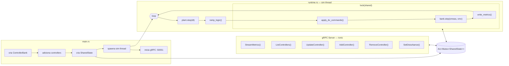

# Camada de Controle do TEP CPS

Este documento descreve a arquitetura de controle injetável (implementada no Exp 11) e as ações de controle ativas na planta.

---

## Como adicionar um controlador

A camada de controle é separada do modelo da planta. O runtime não contém lógica de controle — ele recebe um `ControllerBank` pronto e o executa a cada tick.

### Arquitetura



Detalhes da API gRPC em [07-grpc-architecture.md](07-grpc-architecture.md).

### Trait Controller

Qualquer struct que implemente esta trait pode ser injetada na planta:

```rust
// controllers/mod.rs
pub trait Controller: Send {
    fn step(&mut self, xmeas: &[f64], xmv: &mut [f64]);
    fn id(&self) -> &str;
    fn info(&self) -> ControllerInfo;
    fn update(&mut self, params: &ControllerParams);
}
```

- `step(xmeas, xmv)` — executa um passo de controle: lê medições, escreve manipuladas
- `id()` — identificador único (ex: `"pressure_reactor"`)
- `info()` — snapshot dos parâmetros atuais do controlador
- `update(params)` — aplica alterações parciais de parâmetros em runtime (usado pelo gRPC)

`xmeas` é o vetor de 22 medições contínuas (leitura). `xmv` é o vetor de 12 variáveis manipuladas (escrita).

### ControllerBank

```rust
// controllers/mod.rs
pub struct ControllerBank {
    controllers: Vec<Box<dyn Controller>>,
}

impl ControllerBank {
    pub fn add(&mut self, ctrl: Box<dyn Controller>);
    pub fn remove(&mut self, id: &str) -> bool;
    pub fn get(&self, id: &str) -> Option<&(dyn Controller + '_)>;
    pub fn get_mut(&mut self, id: &str) -> Option<&mut Box<dyn Controller>>;
    pub fn list(&self) -> Vec<ControllerInfo>;
    pub fn step(&mut self, xmeas: &[f64], xmv: &mut [f64]);
}
```

`step()` itera sobre todos os controladores na ordem de inserção. Cada um executa `step()` individualmente. Não há arbitragem — se dois controladores escrevem no mesmo XMV, o último vence. `get`/`get_mut`/`remove`/`list` permitem introspecção e modificação em runtime via gRPC.

### Como adicionar um novo controlador

**1. Usar um `PController` existente (nova malha P):**

Basta adicionar uma linha em `main.rs`:

```rust
bank.add(Box::new(PController::new(
    "temperature_reactor",  // id único
    8,                      // XMEAS(9) = Reactor Temperature
    9,                      // XMV(10) = Reactor Cooling Water
    2.0,                    // kp
    120.4,                  // setpoint
    41.1,                   // bias
)));
```

Ou via gRPC em runtime (sem reiniciar a planta):

```bash
grpcurl -plaintext -d '{
  "id": "temperature_reactor",
  "controller_type": "P",
  "xmeas_index": 8, "xmv_index": 9,
  "kp": 2.0, "setpoint": 120.4, "bias": 41.1
}' localhost:50051 tep.v1.PlantService/AddController
```

**2. Criar um novo tipo de controlador (PID, MPC, etc.):**

Criar um arquivo em `controllers/`, implementar a trait `Controller` completa, e registrar no banco:

```rust
// controllers/pid_controller.rs
use super::{Controller, ControllerInfo, ControllerParams};

pub struct PidController {
    pub id:        String,
    pub xmeas_idx: usize,
    pub xmv_idx:   usize,
    pub kp: f64,
    pub ki: f64,
    pub kd: f64,
    pub setpoint: f64,
    pub bias: f64,
    pub enabled: bool,
    integral: f64,
    prev_error: f64,
}

impl Controller for PidController {
    fn step(&mut self, xmeas: &[f64], xmv: &mut [f64]) {
        if !self.enabled { return; }
        let error = xmeas[self.xmeas_idx] - self.setpoint;
        self.integral += error;
        let derivative = error - self.prev_error;
        self.prev_error = error;
        xmv[self.xmv_idx] = (self.bias + self.kp * error
                              + self.ki * self.integral
                              + self.kd * derivative).clamp(0.0, 100.0);
    }

    fn id(&self) -> &str { &self.id }

    fn info(&self) -> ControllerInfo {
        ControllerInfo {
            id: self.id.clone(),
            controller_type: "PID".into(),
            xmeas_idx: self.xmeas_idx, xmv_idx: self.xmv_idx,
            kp: self.kp, ki: self.ki, kd: self.kd,
            setpoint: self.setpoint, bias: self.bias, enabled: self.enabled,
        }
    }

    fn update(&mut self, params: &ControllerParams) {
        if let Some(kp) = params.kp { self.kp = kp; }
        if let Some(ki) = params.ki { self.ki = ki; }
        if let Some(kd) = params.kd { self.kd = kd; }
        if let Some(sp) = params.setpoint { self.setpoint = sp; }
        if let Some(b) = params.bias { self.bias = b; }
        if let Some(en) = params.enabled { self.enabled = en; }
    }
}
```

Nenhuma modificação em `runtime.rs` é necessária.

---

## Ordem de execução no loop

```
tick k:
  plant.step(dt)          ← integra usando os mv escritos no tick k-1
  ramp_logic()            ← ajusta feed valves (só durante cold start)
  bank.step(xmeas, xmv)  ← controladores leem medições do tick k,
                             escrevem mv que serão aplicados no tick k+1
```

O mv calculado no passo k é aplicado no passo k+1. Isso é um atraso de um passo — semântica padrão de controle discreto (zero-order hold). Detalhes em `docs/01-premissas.md § Premissas para o Desacoplamento`.

---

## Ações de controle ativas

A planta opera com três controladores proporcionais (P). Nenhum tem ação integral ou derivativa.

### Malha 1 — Pressão do Reator → Purge Valve

| Parâmetro | Valor                                          |
| --------- | ---------------------------------------------- |
| Medição   | XMEAS(7) — Reactor Pressure [kPa] — `xmeas[6]` |
| Atuador   | XMV(6) — Purge Valve [%] — `xmv[5]`            |
| Setpoint  | 2705.0 kPa                                     |
| Kp        | 0.1                                            |
| Bias      | 40.06%                                         |
| Fórmula   | `mv = clamp(40.06 + 0.1 × (P − 2705), 0, 100)` |

**O que faz:** se a pressão sobe, abre a purge para ventilar gás. Se cai, fecha a purge para reter gás.

**Ganho na prática:** com Kp=0.1, a purge atinge 100% quando a pressão chega a 2705 + (100−40.06)/0.1 = **3305 kPa** — acima do ISD de 3000 kPa. Isso significa que o controlador nunca satura antes do shutdown. Por outro lado, a resposta é lenta: um aumento de 50 kPa move a purge apenas 5 pontos percentuais.

**Offset permanente:** como é controle P puro, a pressão estabiliza em ~2700.5 kPa, não exatamente no setpoint. O offset de ~4.5 kPa é tolerável em regime nominal.

### Malha 2 — Nível do Separador → Underflow do Separador

| Parâmetro | Valor                                         |
| --------- | --------------------------------------------- |
| Medição   | XMEAS(12) — Separator Level [%] — `xmeas[11]` |
| Atuador   | XMV(7) — Separator Underflow [%] — `xmv[6]`   |
| Setpoint  | 50.0%                                         |
| Kp        | 1.0                                           |
| Bias      | 38.1%                                         |
| Fórmula   | `mv = clamp(38.1 + 1.0 × (L − 50), 0, 100)`   |

**O que faz:** se o nível do separador sobe, abre o underflow para drenar líquido para o stripper. Se cai, fecha para reter líquido.

**Ganho na prática:** Kp=1.0 significa que cada 1% de desvio no nível produz 1% de mudança na válvula. Atinge 100% em L=111.9% (impossível, pois ISD dispara em 90%) e 0% em L=11.9%.

### Malha 3 — Nível do Stripper → Produto do Stripper

| Parâmetro | Valor                                        |
| --------- | -------------------------------------------- |
| Medição   | XMEAS(15) — Stripper Level [%] — `xmeas[14]` |
| Atuador   | XMV(8) — Stripper Product [%] — `xmv[7]`     |
| Setpoint  | 50.0%                                        |
| Kp        | 1.0                                          |
| Bias      | 46.5%                                        |
| Fórmula   | `mv = clamp(46.5 + 1.0 × (L − 50), 0, 100)`  |

**O que faz:** se o nível do stripper sobe, abre a válvula de produto para retirar líquido. Se cai, fecha para reter.

**Ganho na prática:** mesma sensibilidade da malha 2. Atinge 100% em L=103.5% e 0% em L=3.5%.

---

## O que NÃO está sendo controlado

Das 12 variáveis manipuladas, apenas 3 estão sob controle automático. As 9 restantes operam em malha aberta (valor fixo do snapshot):

| XMV        | Descrição                | Estado         | Valor nominal |
| ---------- | ------------------------ | -------------- | ------------- |
| XMV(1)     | D Feed Flow              | malha aberta   | 63.05%        |
| XMV(2)     | E Feed Flow              | malha aberta   | 53.98%        |
| XMV(3)     | A Feed Flow              | malha aberta   | 24.64%        |
| XMV(4)     | A&C Feed Flow            | malha aberta   | 61.30%        |
| XMV(5)     | Compressor Recycle Valve | malha aberta   | 22.21%        |
| **XMV(6)** | **Purge Valve**          | **controlado** | **~40%**      |
| **XMV(7)** | **Separator Underflow**  | **controlado** | **~38%**      |
| **XMV(8)** | **Stripper Product**     | **controlado** | **~47%**      |
| XMV(9)     | Stripper Steam Valve     | malha aberta   | 47.45%        |
| XMV(10)    | Reactor Cooling Water    | malha aberta   | 41.11%        |
| XMV(11)    | Condenser Cooling Water  | malha aberta   | 18.11%        |
| XMV(12)    | Agitator Speed           | fixa           | 50.00%        |

### Implicações

**Temperatura do reator** — não tem malha de controle. Em regime nominal, o calor de reação equilibra com o resfriamento fixo (XMV(10) = 41.1%). Qualquer distúrbio térmico (IDV(4), IDV(10), IDV(11)) é rejeitado apenas pela inércia térmica do reator, sem correção ativa.

**Composição** — nenhuma malha de composição. Os feeds operam em malha aberta. Distúrbios de composição (IDV(1), IDV(2), IDV(8)) propagam sem atenuação até que o efeito apareça em pressão ou nível.

**Compressor** — válvula de reciclo fixa. Variações de carga no compressor (e.g. por IDV(5), IDV(19)) não são compensadas.

---

## Referência: XMEAS (medições contínuas)

| #   | Descrição                               | Unidade | Índice (0-based) |
| --- | --------------------------------------- | ------- | ---------------- |
| 1   | A Feed (stream 1)                       | kscmh   | `xmeas[0]`       |
| 2   | D Feed (stream 2)                       | kg/hr   | `xmeas[1]`       |
| 3   | E Feed (stream 3)                       | kg/hr   | `xmeas[2]`       |
| 4   | A and C Feed (stream 4)                 | kscmh   | `xmeas[3]`       |
| 5   | Recycle Flow (stream 8)                 | kscmh   | `xmeas[4]`       |
| 6   | Reactor Feed Rate (stream 6)            | kscmh   | `xmeas[5]`       |
| 7   | Reactor Pressure                        | kPa     | `xmeas[6]`       |
| 8   | Reactor Level                           | %       | `xmeas[7]`       |
| 9   | Reactor Temperature                     | °C      | `xmeas[8]`       |
| 10  | Purge Rate (stream 9)                   | kscmh   | `xmeas[9]`       |
| 11  | Product Separator Temperature           | °C      | `xmeas[10]`      |
| 12  | Product Separator Level                 | %       | `xmeas[11]`      |
| 13  | Product Separator Pressure              | kPa     | `xmeas[12]`      |
| 14  | Product Separator Underflow (stream 10) | m³/hr   | `xmeas[13]`      |
| 15  | Stripper Level                          | %       | `xmeas[14]`      |
| 16  | Stripper Pressure                       | kPa     | `xmeas[15]`      |
| 17  | Stripper Underflow (stream 11)          | m³/hr   | `xmeas[16]`      |
| 18  | Stripper Temperature                    | °C      | `xmeas[17]`      |
| 19  | Stripper Steam Flow                     | kg/hr   | `xmeas[18]`      |
| 20  | Compressor Work                         | kW      | `xmeas[19]`      |
| 21  | Reactor CW Outlet Temp                  | °C      | `xmeas[20]`      |
| 22  | Separator CW Outlet Temp                | °C      | `xmeas[21]`      |

## Referência: XMV (variáveis manipuladas)

| #   | Descrição                | Unidade    | Índice (0-based) | VRNG   |
| --- | ------------------------ | ---------- | ---------------- | ------ |
| 1   | D Feed Flow              | % → kmol/h | `xmv[0]`         | 400.0  |
| 2   | E Feed Flow              | % → kmol/h | `xmv[1]`         | 400.0  |
| 3   | A Feed Flow              | % → kmol/h | `xmv[2]`         | 100.0  |
| 4   | A&C Feed Flow            | % → kmol/h | `xmv[3]`         | 1500.0 |
| 5   | Compressor Recycle Valve | %          | `xmv[4]`         | —      |
| 6   | Purge Valve              | %          | `xmv[5]`         | —      |
| 7   | Separator Underflow      | % → kmol/h | `xmv[6]`         | 1500.0 |
| 8   | Stripper Product         | % → kmol/h | `xmv[7]`         | 1000.0 |
| 9   | Stripper Steam Valve     | % → kmol/h | `xmv[8]`         | 0.03   |
| 10  | Reactor Cooling Water    | % → m³/h   | `xmv[9]`         | 1000.0 |
| 11  | Condenser Cooling Water  | % → m³/h   | `xmv[10]`        | 1200.0 |
| 12  | Agitator Speed           | %          | `xmv[11]`        | —      |

**VRNG** = range da válvula. A vazão real é `flow = (xmv / 100) × VRNG`. As válvulas possuem dinâmica de primeira ordem com constantes de tempo entre 5 e 120 segundos.

## Limites de shutdown (ISD)

| Variável            | Limite inferior | Limite superior |
| ------------------- | --------------- | --------------- |
| Reactor Pressure    | —               | > 3000 kPa      |
| Reactor Level       | < 10%           | > 90%           |
| Reactor Temperature | —               | > 175°C         |
| Separator Level     | < 10%           | > 90%           |
| Stripper Level      | < 10%           | > 90%           |
